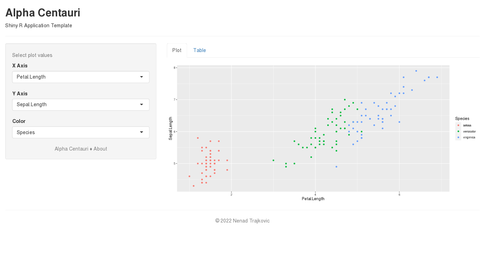
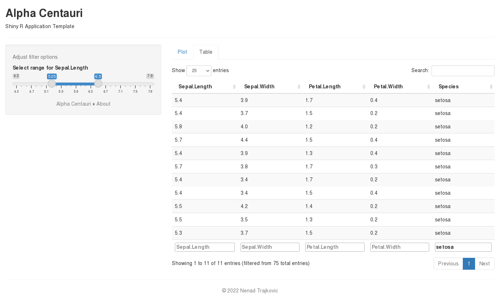
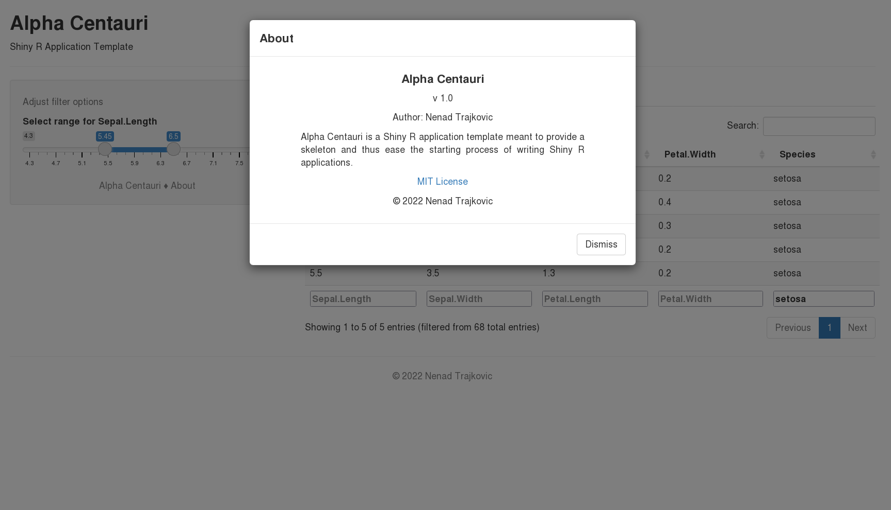
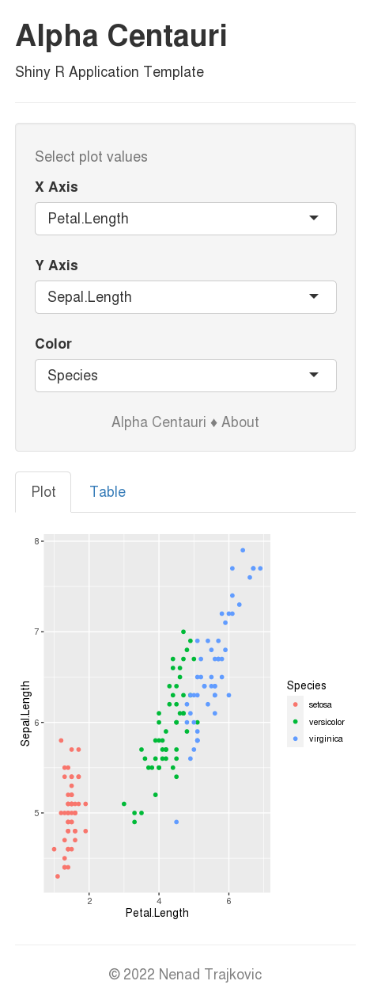

# Alpha Centauri
Shiny R application template

## Screenshots

<table>
  <thead>
    <tr> <th> Plot <th> Table <th> About <th> Mobile
  <tbody>
    <tr valign="top">
      <td><a href="screenshots/alpha-centauri-plot.png" title="Open image">
             
            Alpha Centauri Plot</a>
      <td><a href="screenshots/alpha-centauri-table.png" title="Open image">
             
            Alpha Centauri Table</a>
      <td><a href="screenshots/alpha-centauri-about.png" title="Open image">
             
            Alpha Centauri About</a>
      <td><a href="screenshots/alpha-centauri-mobile.png" title="Open image">
             
            Alpha Centauri Mobile</a>
</table>

## License
This project is licensed under [MIT License](LICENSE "Read the LICENSE file").

[Know your rights](https://choosealicense.com/licenses/mit/ "Read about MIT License permissions").

&copy; 2022 Nenad Trajkovic
