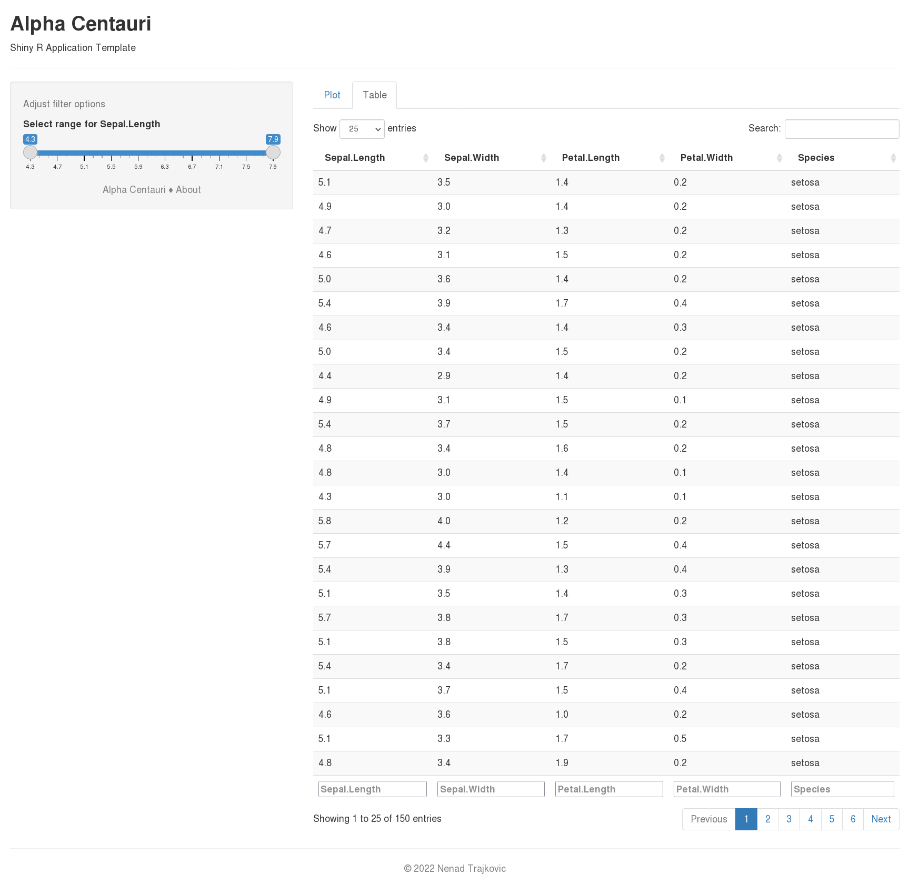

# Alpha Centauri

Shiny R application template

## General Notes

Alpha Centauri is a Shiny R application template meant to provide a skeleton and thus ease the starting process of writing Shiny R applications. The skeleton is very simple and provides a sidebar layout with conditional controls for basic plot and table. About dialog, copyright notice, and license information, are also available.

The goal of the project is to override the first shock of ugly and weird R language syntax, the absence of well-adopted standards, and non-consistent examples in documentation (this is how R looks at first glance). In contrast, Alpha Centauri is a well-founded and universal Shiny R template, on top of which one can easily build many simple and useful dataset dashboards.

## Screenshots

<table>
  <thead>
    <tr> <th> Plot <th> Table <th> About <th> Mobile
  <tbody>
    <tr valign="top">
      <td><a href="screenshots/alpha-centauri-plot.png" title="Open image">
             
            Alpha Centauri Plot</a>
      <td><a href="screenshots/alpha-centauri-table.png" title="Open image">
             
            Alpha Centauri Table</a>
      <td><a href="screenshots/alpha-centauri-about.png" title="Open image">
             
            Alpha Centauri About</a>
      <td><a href="screenshots/alpha-centauri-mobile.png" title="Open image">
             
            Alpha Centauri Mobile</a>
</table>

## Developer's Notes

Add Features tab with an example:
- Image
- Formatting table
- Math formula
- File control to upload Excel file and show it in a table

Features tab should be a separate logical section that presents additional utility options that one can use to upgrade the basic functionality of the Alpha Centauri template.

Add Plot button "Download as PNG".

Add Table buttons "Download as Excel" and "Download as CSV".

Add Features tab buttons "Download as PDF" and "Download as Word".

## License

This project is licensed under [MIT License](LICENSE "Read the LICENSE file").

[Know your rights](https://choosealicense.com/licenses/mit/ "Read about MIT License permissions").

&copy; 2022 Nenad Trajkovic
